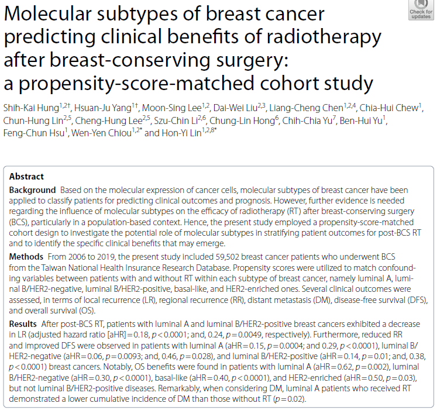

# OSIA manuscript abstracts for 2026

## Table of Contents

1. [Barbuti et al 2025](#barbuti-et-al-2025), first reader: Jeff Lambe
2. [Hung et al 2023](#hung-et-al-2023), first reader: Lily Zhang
3. [Palzes et al 2026](#palzes-et-al-2026), first reader: Mariam Zayour
4. [Rogerson et al 2024](#rogerson-et-al-2024), first reader: Fai Albuainain
5. [Tran et al 2026](#tran-et-al-2026), first reader: Kathryn Menta

## Barbuti et al. 2025

## Hung et al. 2023

## Palzes et al. 2026

## Rogerson et al. 2024

## Tran et al. 2026

