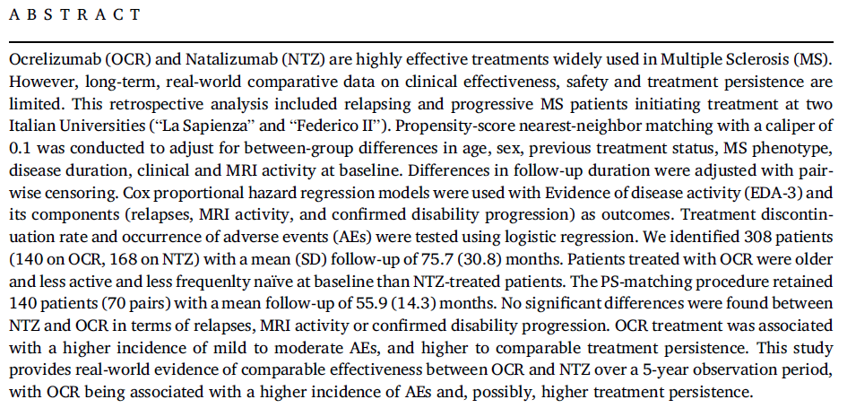
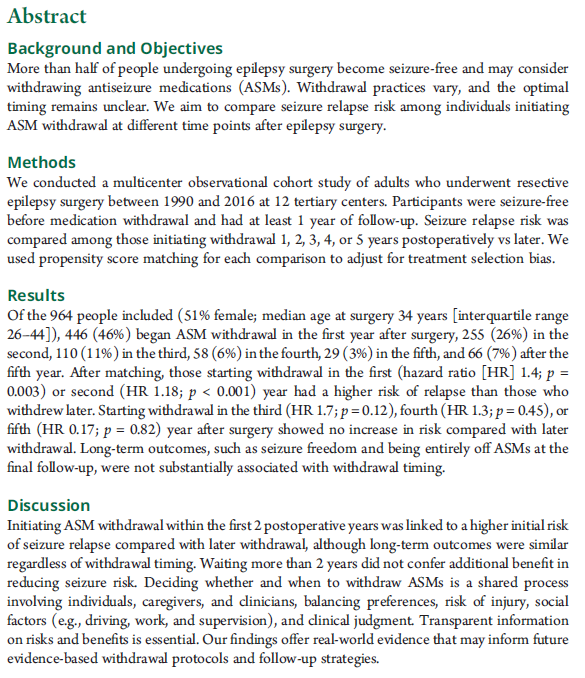
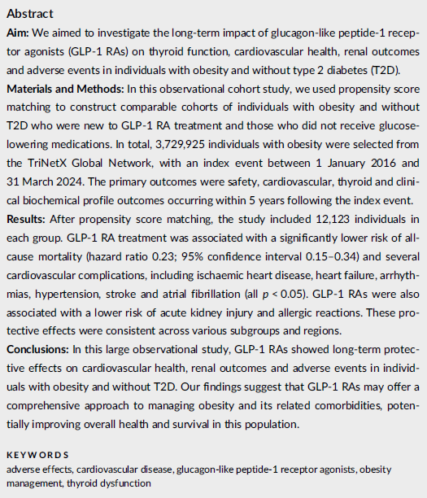
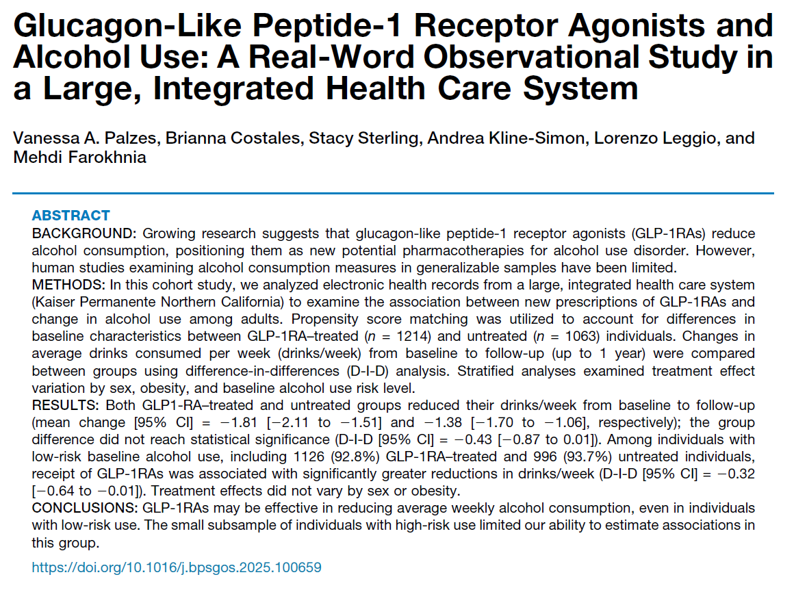
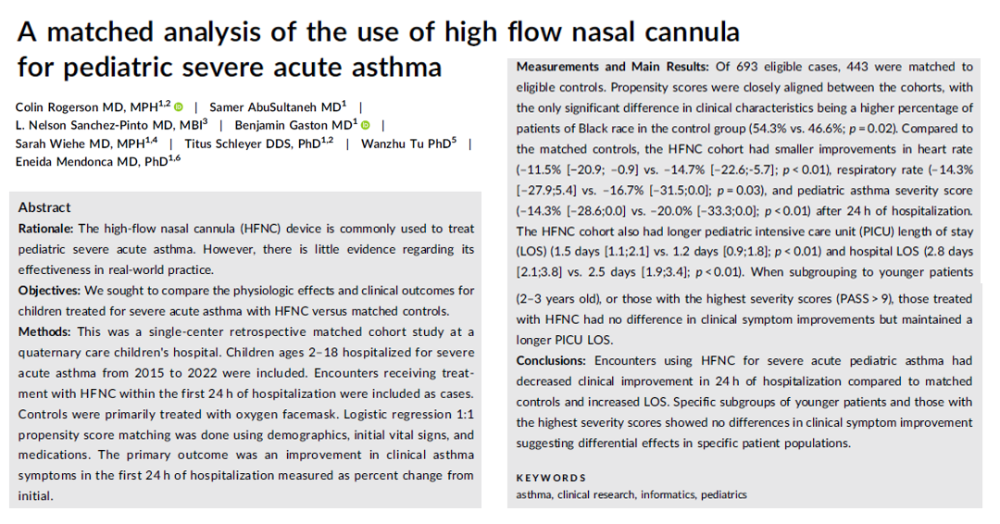
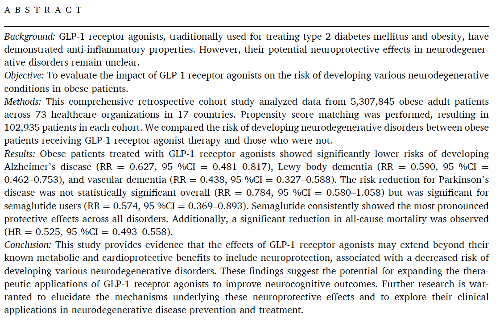
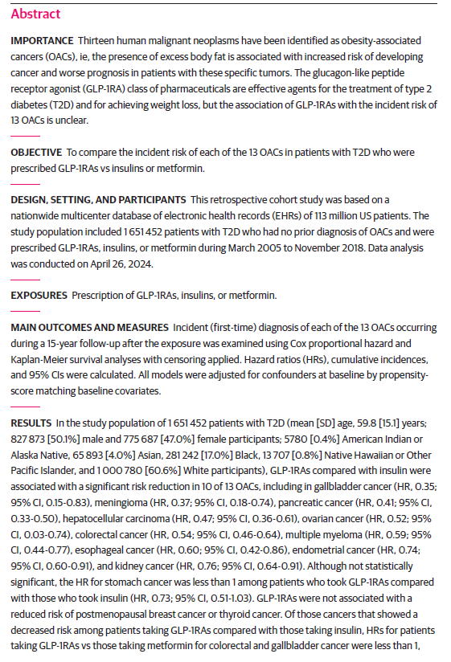
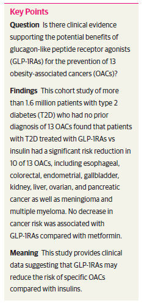
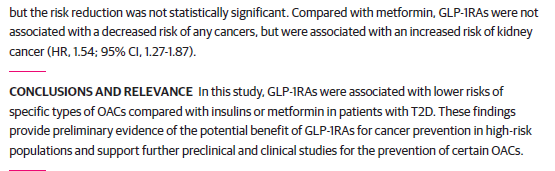

# OSIA manuscript abstracts for 2026

For links to the complete schedule and articles, [visit here](https://github.com/THOMASELOVE/500-classes-2026/tree/main/osia).

## Table of Contents

1. [Barbuti et al 2025](#barbuti-et-al-2025), first reader: Jeff Lambe
2. [Ferreira-Atuesta et al 2026](#ferreira-atuesta-et-al-2026), first reader: Megan Zelinsky
3. [Huang YN et al 2024](#huang-yn-et-al-2024), first reader: Feriel Presswalla
4. [Hung SK et al 2023](#hung-et-al-2023), first reader: Lily Zhang
5. [Palzes et al 2026](#palzes-et-al-2026), first reader: Mariam Zayour
6. [Rogerson et al 2024](#rogerson-et-al-2024), first reader: Fai Albuainain
7. [Siddeeque et al 2024](#siddeeque-et-al-2024), first reader: Saar Anis
8. [Tran et al 2026](#tran-et-al-2026), first reader: Kathryn Menta
9. [Wang et al 2024](#wang-et-al-2024), first reader: Wala'a Alshaia

## Barbuti et al. 2025

## Ferreira-Atuesta et al. 2026

## Huang YN et al. 2024

## Hung et al. 2023

## Palzes et al. 2026

## Rogerson et al. 2024

## Siddeeque et al. 2024

## Tran et al. 2026

## Wang et al. 2024

